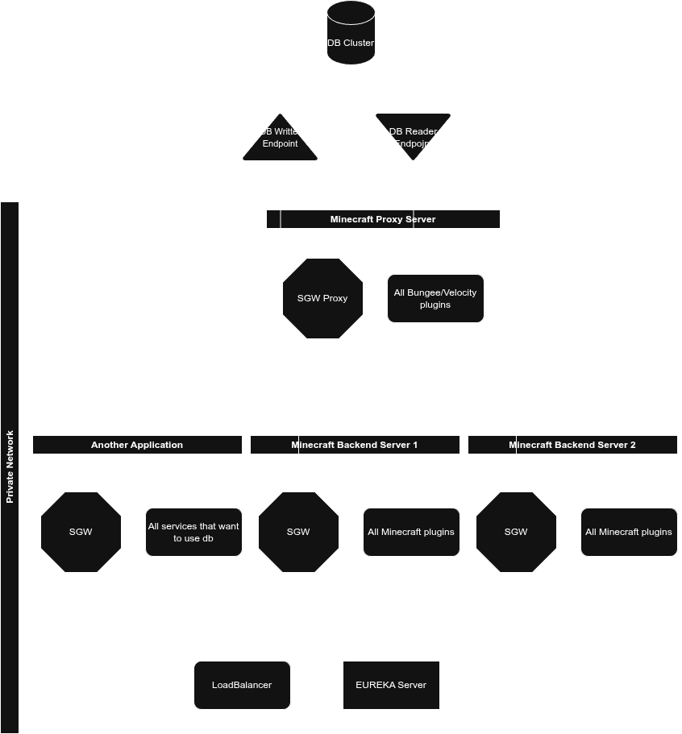

# StorageGatewayAPI

### Reduce the connection to db in the private network as much as possible while provide a blazing fast response

We have experienced open minecraft servers that scaling to infinite player in the same world, but the cost of 10+ plugins connections and dynamic backend node, usage cost on DB server to bump up like crazy. With this solution, we reduced the cost on Database over 99%. While use 5% more compute power & 1% storage increase. And faster latency.



A single API for simple `get`/`set` key-value storage with **fast local reads** and **write-behind** to MySQL. It can run:
- on a **backend** (Spigot/Paper/Folia; Java 8 bytecode), and/or
- on a **proxy** (Bungee **or** Velocity; Velocity requires Java 17).

The plugin always serves from local cache immediately, then **queues** persistence to MySQL in the background. Under load or pool exhaustion, your plugin still gets fast responses; the gateway drains the queue when the DB is ready.
Highly customization. You can even put Load balancer & Eureka server outside private network and let all SGW connect to load balancer gateway and set to proxy mode without using minecraft proxy server. 
You can even share sgw database connection with another application without open more connection to the database.

## Why don't use proxy db server
- because it won't work with minecraft that have tons of plugins that want to connect to 1 database(or db cluster), since db proxy just limit the connection to db. It doesn't manage the connection. Mean db proxy limit to 10. and 20 plugins try to open connection to the db -> some of them will fail and only 10 connection are successfully connect to db.
- while most db proxy have read-write split. But it cannot have multiple writer or support writer endpoints.

## Cons
- Since this is designed to be `key-value` based that aimed for speed and least connections. Migration is a disaster, but if you using kv or start a new db this is perfectly fine.
- Data stored on db may hard/unreadable by human, It won't be compatible with another services that does not use SGW.
---

## Why this exists

- **One tiny API** (`StorageGateway.open().get()/set()`) instead of every plugin opening its own pools.
- **Write-behind**: never block the main thread on DB; `set()` returns immediately after local write.
- **Per-DB modes**: `local-only`, `direct-sql`, `proxy-sql`.
- **RW-Split**: `local-only`, `direct-sql`, `proxy-sql`.
- **Multiple entry**: `standalone jar`, `Spigot, Paper plugins`, `http api`, `cp|-Dloader.path` and so much more
- **Multi-currency Vault hook** (optional) and **PlayerPoints delegate** (optional).
- **Java8+**: Compatible with almost everything.

---

## Architecture

### Backend only (no proxy)
```

YourPlugin ──> StorageGateway (Spigot)
├─ L1 Near Cache (Caffeine)
├─ Local durability (files + WAL)
└─ [optional] async MySQL flush (writer pool)

```

### Proxy-SQL (recommended for networks)
```

YourPlugin ──> Backend SGW ──PM──> Proxy SGW ──> L1 + WAL ──queue─> MySQL
^ near cache                          (Bungee or Velocity)

````
- Backend uses plugin messaging to proxy. Backend never touches MySQL in this mode.

*(Redis L2 cache/queue is planned; flags exist but are off by default.)*

---

## Modules & Java requirements

- **plugin**: Bukkit/Spigot/Paper/Folia **and** Bungee in one JAR. Compiled with JDK 17, emits Java 8 bytecode.
- **velocity**: Velocity plugin (separate JAR, Java 17+).
- **demo-eco**: example plugin showing API usage (Java 8 bytecode).

### Build
```bash
./gradlew clean buildAll
````

---

## Using the API

Add a dependency on the **API** (exposed by `core`):

```gradle
repositories {
  maven { url 'https://repo.rainbowcreation.net/' }
}
dependencies {
  compileOnly 'net.rainbowcreation:StorageGatewayAPI:1.2'
}
```

Then in your plugin:

```java
import net.rainbowcreation.storage.api.StorageGateway;
import net.rainbowcreation.storage.api.StorageClient;

StorageGateway gw = getServer().getServicesManager().load(StorageGateway.class);
StorageClient c = gw.open("main", "CHANGE_ME_main_secret");

// set
c.set("players", "coins:"+uuid, 250)
 .exceptionally(err -> { getLogger().warning(err.toString()); return null; });

// get
c.get("players", "coins:"+uuid, Integer.class)
 .thenAccept(opt -> {
   int coins = opt.orElse(0);
   // switch to main thread before touching Bukkit API
   getServer().getScheduler().runTask(this, () ->
       player.sendMessage("Coins: " + coins));
 });
```

Standalone access via static class
```
StorageGateway gw = SgwAPI.get();
StorageClient c = gw.open("main", "CHANGE_ME_main_secret");

// other get set same as before
```

Api access via http endpoints default port ``7070`` or via `loadbalancer` & `eureka server`

Structure ``localhost:7070/{db}/{namespace}/{key}`` or `{loadbalancerUrl:port}/{db}/{namespace}/{key}`

 method

``get`` required ``token`` which is the secret set in ``config.yml``

``post`` required ``token`` which is the secret set in ``config.yml`` and ``value``

**Semantics**

* `set()` is **fire-and-succeed** unless the local durability step fails (e.g., disk I/O error).
* `get()` returns what’s in cache; on cold miss it may read DB (direct mode) or return local/disk if budget is saturated.

---

## Complex Class, Object

### install ``StorageGatewayAPI-template``
```
dependencies {
   implementation 'net.rainbowcreation:StorageGatewayAPI-template:1.0'
}
```
this module provide `AData` class and `IDataManger` interface than can be easily use for interfacing complex class|data structure with sgw


## Setup

### BungeeCord (Optional)

* Drop **StorageGatewayAPI-{version}.jar** (the **plugin** artifact) into `plugins/` on Bungee.
* Configure DBs/mode in the proxy’s `plugins/StorageGatewayAPI/config.yml`.
* Ensure `proxy.pluginMessaging.enabled: true` and a channel name (e.g. `"sgw:psync"`).
* Start Bungee; you should see “proxy ready” in logs.

### Velocity (Optional)

* Drop **StorageGatewayAPI-Velocity-{version}.jar** (the **velocity** artifact) into `plugins/` on Velocity.
* Same config file path and keys as Bungee.
* Use a **namespaced** channel (e.g. `"sgw:psync"`).
* On shutdown, the gateway flushes and stops cleanly.

### Backends

* Install **StorageGatewayAPI-{version}.jar** (the **plugin** artifact).
* Configure the same DB names/secrets.
* For `proxy` mode, set `proxy.pluginMessaging.enabled: true` and the **same** channel string as set on proxy server.
* Enable proxy mode **per DB** and on proxy server as well
* Proxy mode will ignore mysql settings and use proxy's settings instead.

---

## Performance & reliability knobs

* `limits.mysqlTotalBudget`: global permits for DB reads. If zero, all cold reads will use local/disk fallback.
* `execution.coreThreads / maxThreads / queueCapacity`: controls async workers.
* MySQL writer pool: `pool.maxPoolSize / minIdle / connectionTimeoutMs`.
* Read Your Writes: guaranteed via near-cache update on `set()`; tune `mode.readYourWritesMs` for how long to prefer cache before considering DB freshness (if you implement stricter coherence later).

---
